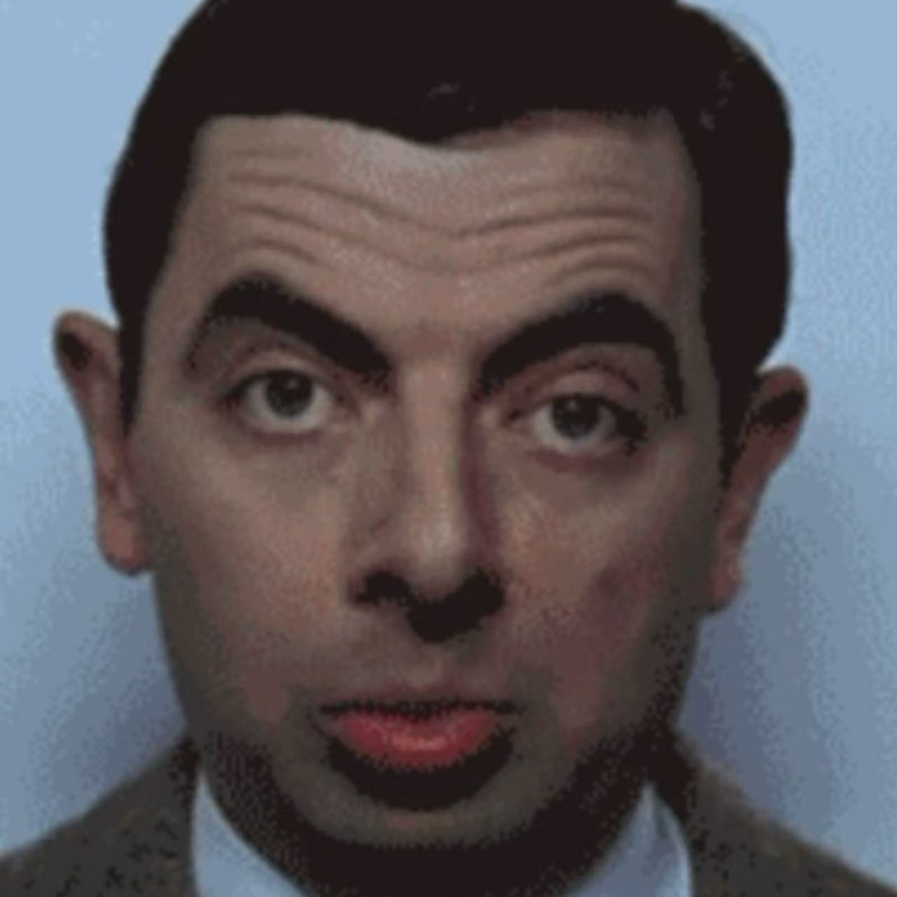
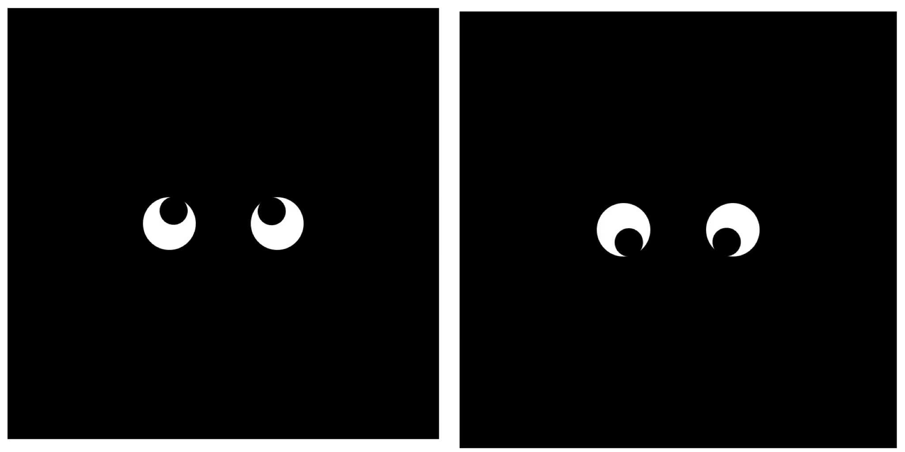

# slyu0503_9103_tut5

# IDEA9103 Quiz 8 – Design Research

## Part 1: Imaging Technique Inspiration – Mr. Bean's Expressive Eyes

Inspired by Mr. Bean’s exaggerated and expressive eye movements, I chose two contrasting images to explore how eye motion conveys attention and emotion. One image shows calm, symmetric eye contact; the other shows chaotic, cross-eyed confusion. This clip inspired, I was originally only focusing on flat shapes, the eyes made me think that pictures can be three dimensional, there are artworks made up of circles stacked on top of each other, analogous to an eye, with the centremost circle rotating like a pupil, giving the whole piece a more layered look.

**Images:**

  
*Calm, symmetric eye contact*

  
*Chaotic, cross-eyed confusion*

---

## Part 2: Coding Technique Exploration – `atan2()` Based Eye Tracking (p5.js)

This p5.js technology uses `atan2()` to calculate the angle between the eye and the cursor. It will turn the pupil towards the mouse in real time, allowing the eyes to ‘follow’ the user. This dynamic effect can make monotonous images more layered and can enhance the sense of interaction between the image and the user, making my projects more interesting.

**Screenshots:**

  
*Eyes tracking upward and downward*

 **Code Reference:**  
[https://p5js.org/examples/angles-and-motion-aim/](https://p5js.org/examples/angles-and-motion-aim/)
